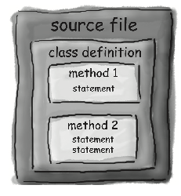

* Each source file in Java language has a `.java` extension and must include a class with the same name.
* To make your Java file executable, define a `main` method inside the class.
* Curly braces { } define the boundaries of structures such as classes and methods.
* Any code that should run must be written inside the main method.
* The file you are viewing demonstrates the structure of a basic Java program.

