# Mastering OOP Fundamentals with SOLID Principles

Imagine trying to build a complex machine, but instead of using pre-made, reusable parts, we have to carve each component. Every screw, bolt, and gear must be recreated from scratch, making the process slow, error-prone, and nearly impossible to scale.

Software development faces the same challenge. Projects can become unmanageable and fragile without a structured way to reuse, organize, and scale code.

That’s where Object-Oriented Programming (OOP) comes in.

OOP is a programming paradigm that organizes software around objects. Think of objects like LEGO bricks. Each object is a self-contained unit that bundles together data and the methods that operate on that data. By using modular and reusable components, developers can build complex systems efficiently without reinventing the wheel every time.

A few key reasons why OOP is so widely used in modern development are as follows:

* OOP lets developers structure large applications into smaller, modular components. 
* If OOP is applied correctly, changes in one part of the code are less likely to break other parts. 
* OOP allows better code reuse opportunities. 
* Data is protected and accessible through controlled mechanisms.

Four core fundamentals form the foundation of object-oriented programming: encapsulation, abstraction, inheritance, and polymorphism.

However, just knowing these principles is not enough. While OOP provides structure, not all object-oriented code is good code. To avoid this, developers also follow SOLID principles.

In this article, we will take a deep dive into the core fundamentals of OOP followed by an introduction to the SOLID principles.

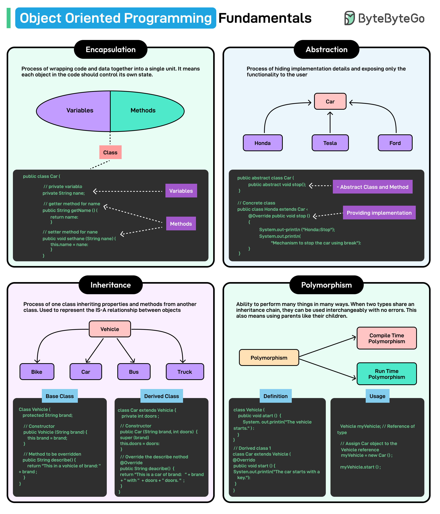

## Core Fundamentals of OOP

Let’s look at the four main principles of OOP one by one.

### 1 - Encapsulation

Encapsulation refers to bundling data (variables) and the methods (functions) that operate on that data into a single unit known as a class.

It plays a crucial role in object-oriented design for multiple reasons:

* Encapsulation helps enforce controlled access to an object's internal state, restricting direct modification from outside the class.
* It allows access to object properties through specific methods, thereby ensuring consistency.

Consider a bank account as an example of encapsulation. A bank does not allow customers direct access to their account balance in its internal database. Instead, users interact with their account through well-defined methods (such as depositing and withdrawing money). These methods can enforce rules such as “the user cannot withdraw more than the available balance”.

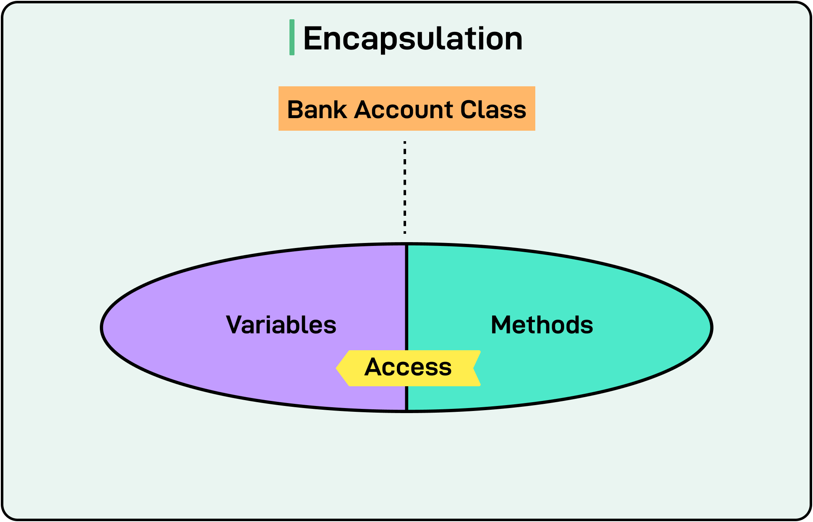

Programming languages provide mechanisms to support encapsulation. For example, Java implements encapsulation using access modifiers such as private, protected, and public. The most common approach is to declare class attributes private and provide public getter and setter methods for controlled access.

See the example below of a basic implementation of the BankAccount class:
```jshelllanguage
// BankAccount class demonstrating encapsulation
class BankAccount {
// Private attribute (data is hidden from direct access)
private double balance;

    // Constructor to initialize balance
    public BankAccount(double initialBalance) {
        if (initialBalance > 0) {
            this.balance = initialBalance;
        } else {
            this.balance = 0; // Ensure balance is never negative
        }
    }

    // Getter method to retrieve the balance (read-only access)
    public double getBalance() {
        return balance;
    }

    // Setter method for depositing money (controlled access)
    public void deposit(double amount) {
        if (amount > 0) {
            balance += amount;
            System.out.println("Deposited: " + amount);
        } else {
            System.out.println("Deposit amount must be positive.");
        }
    }

    // Setter method for withdrawing money (with validation)
    public void withdraw(double amount) {
        if (amount > 0 && amount <= balance) {
            balance -= amount;
            System.out.println("Withdrawn: " + amount);
        } else {
            System.out.println("Invalid withdrawal amount.");
        }
    }
}
```

Note that this code example is just for explanation purposes and should not be treated as real production code.

Let’s break down this example a little more:

* The balance attribute is declared private, meaning it cannot be accessed directly outside the class. 
* The getter method (getBalance()) allows read-only access to the balance. 
* The setter methods (deposit() and withdraw()) allow modifications but enforce business logic constraints, preventing invalid operations. 
* If we try to modify the balance directly from outside the class (account.balance = 5000;), the compiler throws an error.

### 2 - Abstraction

Abstraction in OOP focuses on hiding the complex implementation details of an object while exposing only the necessary features.

Consider driving a car. When we turn the steering wheel, the car changes direction, but we do not need to understand the intricate mechanisms involved, such as how the steering column transfers motion to the wheels or how hydraulic systems assist in turning. The steering wheel abstracts the complex system beneath it, providing a simple interface for the driver.

Similarly, in programming, abstraction allows users to interact with objects without worrying about their complex internal logic. This is achieved through abstract classes and interfaces, which define behaviors without specifying how they are implemented.

See the diagram below for reference:

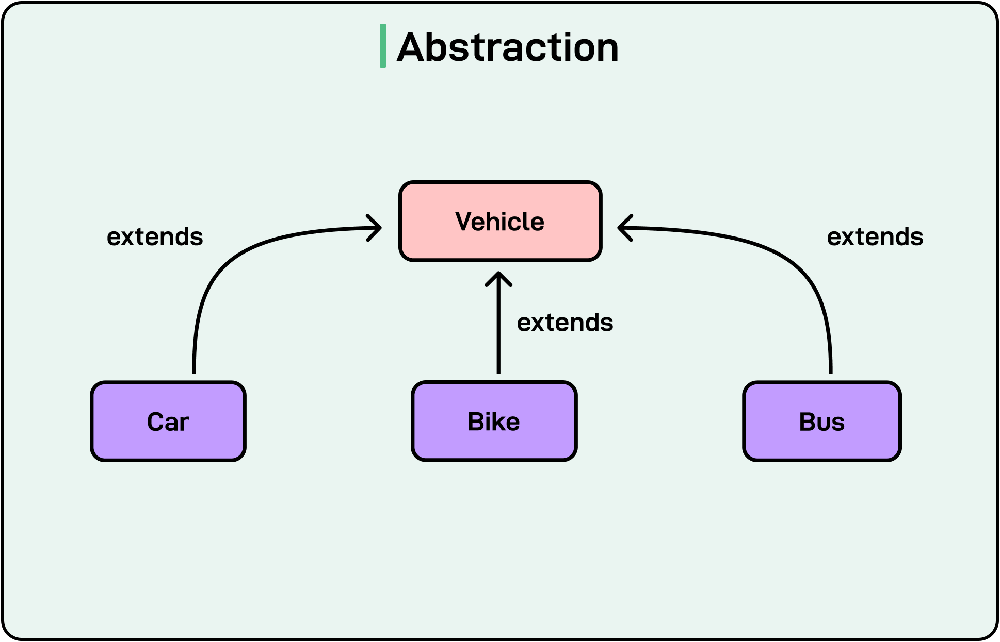

Though both abstraction and encapsulation involve hiding details, they serve different purposes. Encapsulation protects internal data, while abstraction hides implementation details, exposing only relevant functionality to the user.

In Java, abstraction is implemented using abstract classes that define common behavior but allow subclasses to provide specific implementations. Here’s a code example of the same:
```jshelllanguage

// Abstract class representing a Vehicle
abstract class Vehicle {
    // Abstract method (no implementation, only declaration)
    abstract void start();

    // Concrete method (implementation provided)
    void stop() {
        System.out.println("Vehicle is stopping...");
    }
}

// Concrete class (Car) extending the abstract class
class Car extends Vehicle {
    @Override
    void start() {
        System.out.println("Car is starting with a key...");
    }
}

// Concrete class (Bike) extending the abstract class
class Bike extends Vehicle {
    @Override
    void start() {
        System.out.println("Bike is starting with a button...");
    }
}

// Main class to test abstraction
public class Main {
    public static void main(String[] args) {
        Vehicle car = new Car();
        car.start(); // Calls Car's start method
        car.stop();  // Calls the inherited stop method

        Vehicle bike = new Bike();
        bike.start(); // Calls Bike's start method
        bike.stop();  // Calls the inherited stop method
    }
}
```

In case of trying to run this code in an online compiler and facing issues, try moving the Main class at the top. Note that the code is just for example purpose.

The second way to implement abstraction is using interfaces that define a contract that multiple classes can implement. The interface users do not need to know how the methods are implemented. They only need to know that the methods exist and what they do. By focusing on what a class should do rather than how it does it, interfaces promote abstraction.

Here’s an example of the same:

```jshelllanguage
// Interface defining vehicle behavior
interface Vehicle {
    void start();  // Abstract method (no body)

    void stop();
}

// Car class implementing Vehicle interface
class Car implements Vehicle {
    @Override
    public void start() {
        System.out.println("Car is starting...");
    }

    @Override
    public void stop() {
        System.out.println("Car is stopping...");
    }
}

// Bike class implementing Vehicle interface
class Bike implements Vehicle {
    @Override
    public void start() {
        System.out.println("Bike is starting...");
    }

    @Override
    public void stop() {
        System.out.println("Bike is stopping...");
    }
}

// Main class to test interface abstraction
public class Main {
    public static void main(String[] args) {
        Vehicle myCar = new Car();
        myCar.start();
        myCar.stop();

        Vehicle myBike = new Bike();
        myBike.start();
        myBike.stop();
    }
}

```
### 3 - Inheritance

Inheritance allows a class to inherit properties and behavior from another class, promoting code reuse and making applications easier to extend and manage.

At its core, inheritance establishes a parent-child relationship where:

* The parent class (superclass or base class) contains common properties and behaviors. 
* The child class (subclass or derived class) inherits these properties and can extend or modify them.

There are different types of inheritance:

#### Single Inheritance

In this type, a single subclass inherits from one superclass. For example, a Car class inherits from a Vehicle class.

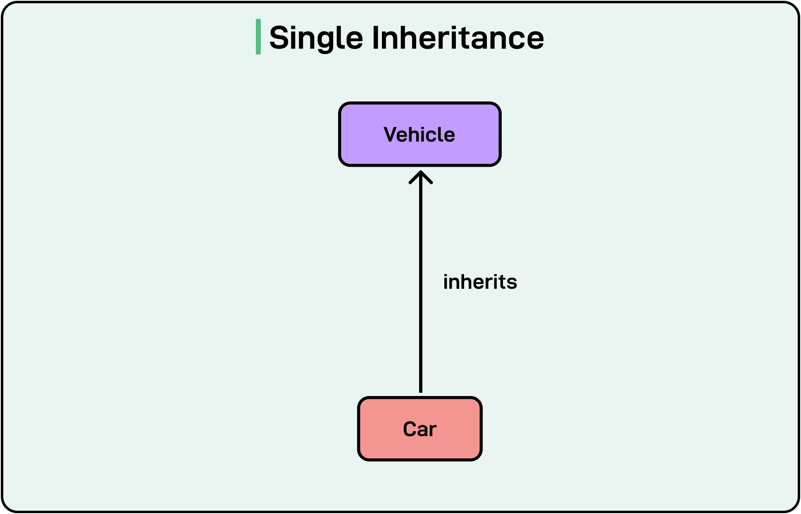

See the code example below:

```jshelllanguage
class Vehicle {
    void move() {
        System.out.println("Vehicle is moving");
    }
}

class Car extends Vehicle {
    void honk() {
        System.out.println("Car is honking");
    }
}
```
#### Multiple Inheritance

In this type of inheritance, a child class inherits from multiple parent classes. See the diagram below:

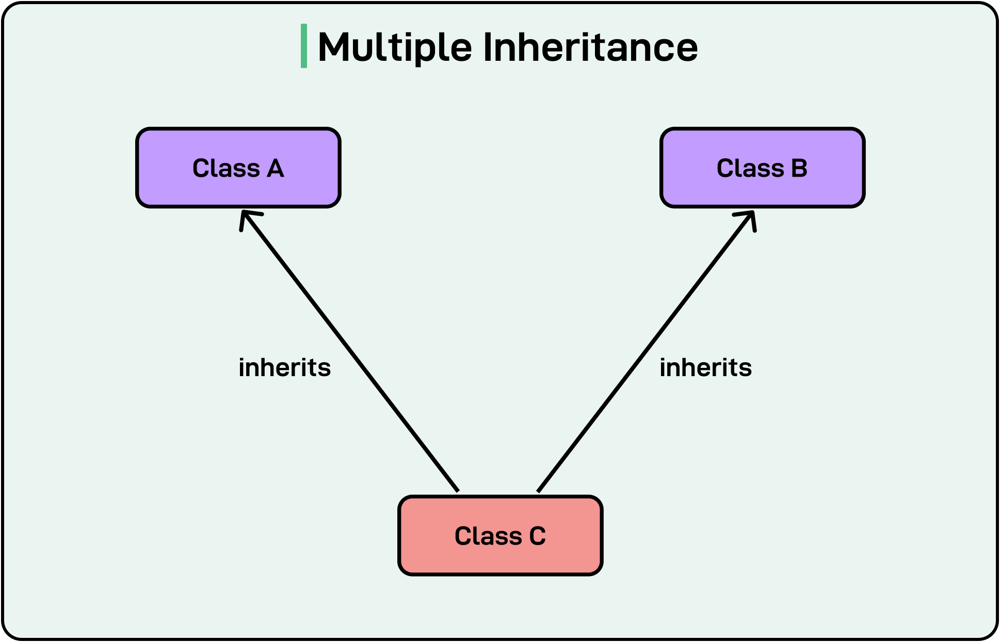

Java does not support multiple inheritance with classes to avoid the diamond problem where a class inherits from two parent classes that have the same method, leading to ambiguity.

However, multiple inheritance in Java can be achieved using interfaces. See the code example below:
```jshelllanguage
interface Engine {
    void startEngine();
}

interface Wheels {
    void rotate();
}

class Car implements Engine, Wheels {
    public void startEngine() {
        System.out.println("Car engine started");
    }

    public void rotate() {
        System.out.println("Car wheels rotating");
    }
}

public class Main {
    public static void main(String[] args) {
        Car myCar = new Car();
        myCar.startEngine();
        myCar.rotate();
    }
}
```

Even if the two interfaces declare the same method, the implementing class must provide its implementation of the method, resolving the conflict.

#### Multilevel Inheritance

In this type of inheritance, a subclass inherits from another subclass, forming a chain of inheritance.

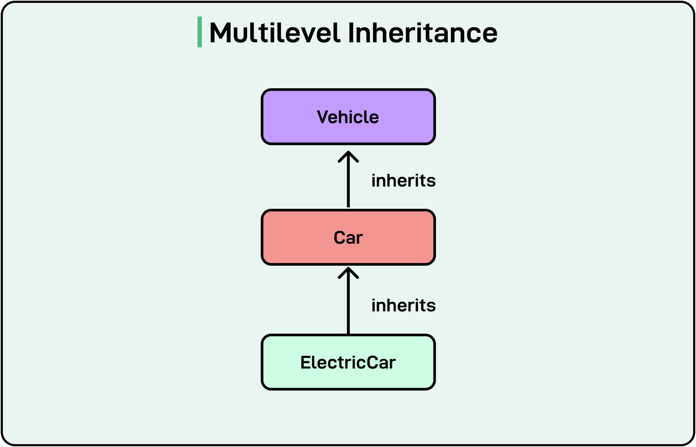

See the code example below:
```jshelllanguage
class Vehicle {
    void move() {
        System.out.println("Vehicle is moving");
    }
}

class Car extends Vehicle {
    void fuelType() {
        System.out.println("Car uses petrol or diesel");
    }
}

class ElectricCar extends Car {
    void batteryCapacity() {
        System.out.println("Electric Car has a 75 kWh battery");
    }
}

public class Main {
    public static void main(String[] args) {
        ElectricCar myTesla = new ElectricCar();
        myTesla.move(); // Inherited from Vehicle
        myTesla.fuelType(); // Inherited from Car
        myTesla.batteryCapacity(); // Defined in ElectricCar
    }
}
```

#### Hierarchical Inheritance

In this type of inheritance, multiple subclasses inherit from the same parent class. See the diagram below:

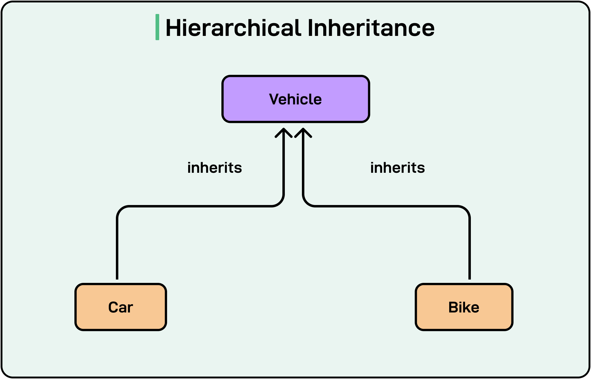

See the example below:
```jshelllanguage
class Vehicle {
    void move() {
        System.out.println("Vehicle is moving");
    }
}

class Car extends Vehicle {
    void honk() {
        System.out.println("Car is honking");
    }
}

class Bike extends Vehicle {
    void kickStart() {
        System.out.println("Bike is kick-starting");
    }
}

public class Main {
    public static void main(String[] args) {
        Car myCar = new Car();
        myCar.move();
        myCar.honk();

        Bike myBike = new Bike();
        myBike.move();
        myBike.kickStart();
    }
}
```

#### Risks of Deep Inheritance Trees

While inheritance helps with code reusability and reduced redundancy, deep inheritance trees can result in maintenance nightmares.

Here’s an example:

```jshelllanguage
class A { void methodA() { System.out.println("A"); } }
class B extends A { void methodB() { System.out.println("B"); } }
class C extends B { void methodC() { System.out.println("C"); } }
class D extends C { void methodD() { System.out.println("D"); } }
// More levels...

public class Main {
public static void main(String[] args) {
D obj = new D();
obj.methodA(); // Inherited from A
obj.methodB(); // Inherited from B
obj.methodC(); // Inherited from C
obj.methodD(); // Defined in D
}
}
```
In the above hypothetical example, if A is modified, B, C, and D may break unexpectedly. Also, debugging is harder when methods are spread across multiple levels.

This is why inheritance should be used with a lot of caution. Also, if possible, it is better to use composition where a class contains another class as a field.

### 4 - Polymorphism

The term polymorphism is derived from Greek, meaning "many forms." In OOP, it allows one method, class, or interface to behave differently in different scenarios.

Consider a person who plays different roles depending on the situation. As a teacher, they explain concepts to students. As a parent, they care for their children. As a friend, they engage in casual conversations. Despite being the same person, their behavior changes based on the context.

Similarly, polymorphism enables a method or an object to perform different actions based on the situation.

In truth, it allows a single interface to represent multiple implementations. The two main types of polymorphism are as follows:

* **Compile-Time Polymorphism (Method Overloading):** The method to execute is determined at compile-time. 
* **Runtime Polymorphism (Method Overriding):** The method to execute is determined at runtime.

#### Compile Time Polymorphism (Method Overloading)

Method overloading occurs when multiple methods in the same class share the same name but have different parameters (different number, type, or sequence of parameters). The compiler determines which method to call based on the method signature.

See the example below:
```jshelllanguage
class MathOperations {
    // Method to add two integers
    int add(int a, int b) {
        return a + b;
    }

    // Overloaded method to add three integers
    int add(int a, int b, int c) {
        return a + b + c;
    }

    // Overloaded method to add two double numbers
    double add(double a, double b) {
        return a + b;
    }
}

public class Main {
    public static void main(String[] args) {
        MathOperations math = new MathOperations();

        System.out.println("Sum of two integers: " + math.add(5, 10));
        System.out.println("Sum of three integers: " + math.add(5, 10, 15));
        System.out.println("Sum of two doubles: " + math.add(5.5, 10.5));
    }
}
```

Here, the method add() is defined multiple times with different parameters. The correct method is chosen by the compiler based on the arguments passed.

#### Runtime Polymorphism (Method Overriding)

Method overriding occurs when a subclass provides a specific implementation of a method that is already defined in its parent class. The method signature remains the same, but the behavior changes.

Here’s a code example for the same:

```jshelllanguage
class Animal {
    // Base method
    void makeSound() {
        System.out.println("Animal makes a sound");
    }
}

class Dog extends Animal {
    // Overriding the makeSound method
    @Override
    void makeSound() {
        System.out.println("Dog barks");
    }
}

class Cat extends Animal {
    // Overriding the makeSound method
    @Override
    void makeSound() {
        System.out.println("Cat meows");
    }
}

public class Main {
    public static void main(String[] args) {
        Animal myAnimal; // Reference variable of parent type

        myAnimal = new Dog();
        myAnimal.makeSound(); // Calls Dog's implementation

        myAnimal = new Cat();
        myAnimal.makeSound(); // Calls Cat's implementation
    }
}
```
Here, the subclasses (Dog and Cat) provide their versions of the makeSound() method. The method is called based on the actual object type at runtime, not the reference type.

---

## SOLID Principles

Understanding OOP fundamental principles like encapsulation, abstraction, inheritance, and polymorphism lays the foundation for writing structured code, but it does not guarantee maintainability or scalability on its own.

To build truly robust, flexible, and extensible applications, developers must also learn about SOLID principles.

Let’s look at each principle in detail:

### 1 - Single Responsibility Principle (S)

The Single Responsibility Principle (SRP) states that a class should have only one reason to change.

When a class handles multiple responsibilities, it becomes harder to maintain and extend. A change in one functionality might inadvertently affect another, increasing the risk of bugs.

By following SRP, we ensure:

* Better code organization because each class has a well-defined purpose. 
* Easier debugging and modification. 
* Improved testability.

Consider a class InvoiceManager that handles invoice calculations, printing invoices, and saving to a database.
```jshelllanguage

class InvoiceManager {
    private double amount;

    public InvoiceManager(double amount) {
        this.amount = amount;
    }

    // Responsibility 1: Calculate total amount
    public double calculateTotal() {
        return amount * 1.18; // Assuming 18% tax
    }

    // Responsibility 2: Print invoice
    public void printInvoice() {
        System.out.println("Invoice Amount: " + calculateTotal());
    }

    // Responsibility 3: Save invoice to database
    public void saveToDatabase() {
        System.out.println("Invoice saved to database.");
    }
}
```
This class has too many responsibilities. It calculates the invoice, prints it, and saves it to the database. If we need to change the way invoices are saved, we might unintentionally break the invoice printing functionality. Also, unit testing is complicated.

Here’s a refactored version of the same class following SRP:

```jshelllanguage
// Responsibility 1: Handles Invoice Calculation
class InvoiceCalculator {
    private double amount;

    public InvoiceCalculator(double amount) {
        this.amount = amount;
    }

    public double calculateTotal() {
        return amount * 1.18; // Assuming 18% tax
    }
}

// Responsibility 2: Handles Invoice Printing
class InvoicePrinter {
    public void printInvoice(double totalAmount) {
        System.out.println("Invoice Amount: " + totalAmount);
    }
}

// Responsibility 3: Handles Invoice Persistence
class InvoiceRepository {
    public void saveToDatabase(double totalAmount) {
        System.out.println("Invoice of amount " + totalAmount + " saved to database.");
    }
}

// Main Class
public class Main {
    public static void main(String[] args) {
        InvoiceCalculator calculator = new InvoiceCalculator(1000);
        double totalAmount = calculator.calculateTotal();

        InvoicePrinter printer = new InvoicePrinter();
        printer.printInvoice(totalAmount);

        InvoiceRepository repository = new InvoiceRepository();
        repository.saveToDatabase(totalAmount);
    }
}
```

Here, each class has a single responsibility as follows:

* **Invoice Calculator:** Handles the computation. 
* **Invoice Printer:** Deals with printing the invoice.
* **Invoice Repository:** Manages persistence.

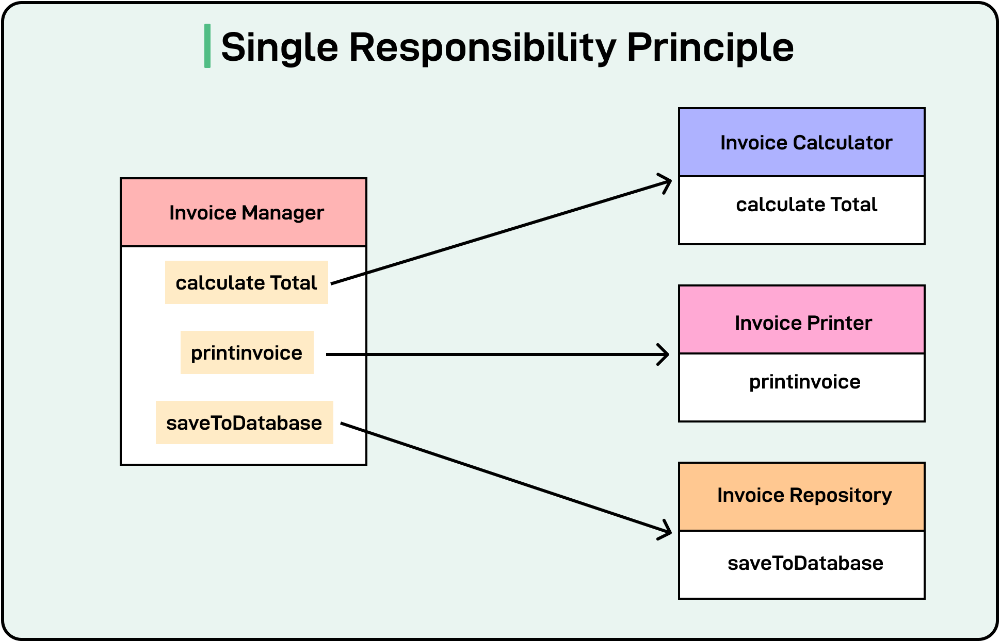

We can now change and test each class separately. The code is also more readable and less complex. Issues can be isolated to a specific responsibility rather than debugging an entire class.

### 2 - Open/Closed Principle (O)

The Open/Closed Principle (OCP) states that classes should be open for extension but closed for modification.

This means that we should be able to extend the functionality of a class without modifying its existing code. Instead of altering an existing class to add new behavior, new functionality should be added by creating new subclasses or implementing interfaces.

Let’s consider a PaymentProcessor class that supports credit card payments. Later, we need to add support for a third-party payment. Here’s an example that does not follow OCP

```jshelllanguage
class PaymentProcessor {
    public void processPayment(String paymentType) {
        if (paymentType.equals("CreditCard")) {
            System.out.println("Processing Credit Card Payment");
        } else if (paymentType.equals("3rdParty")) {
            System.out.println("Processing 3rd Party Payment");
        }
        // Future payment methods would require modifying this class
    }
}
```

Each time a new payment method is added, this class must be modified. In other words, the class is not closed for modification. If other parts of the system depend on PaymentProcessor, changing it could introduce bugs.

To follow OCP, we should create an interface or abstract class and allow new payment methods t added without modifying the existing code.

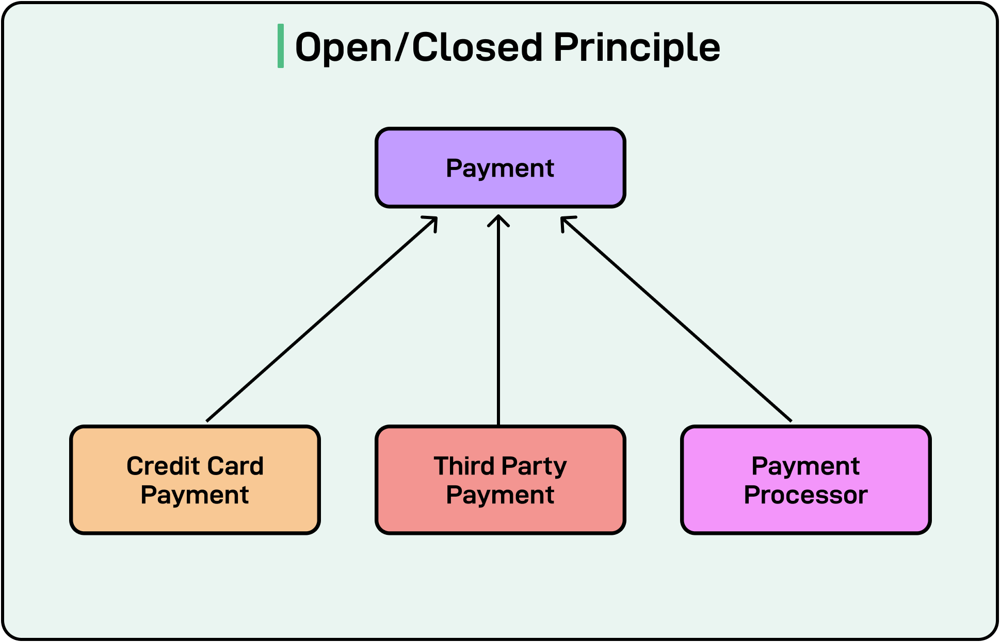
See the example below:

```jshelllanguage
// Step 1: Define an interface for payment processing
interface Payment {
    void processPayment();
}

// Step 2: Implement different payment methods
class CreditCardPayment implements Payment {
    @Override
    public void processPayment() {
        System.out.println("Processing Credit Card Payment");
    }
}

class ThirdPartyPayment implements Payment {
    @Override
    public void processPayment() {
        System.out.println("Processing 3rdParty Payment");
    }
}

// Step 3: Use abstraction to process any payment type
class PaymentProcessor {
    public void process(Payment payment) {
        payment.processPayment();
    }
}

// Step 4: Demonstration
public class Main {
    public static void main(String[] args) {
        PaymentProcessor processor = new PaymentProcessor();

        Payment creditCard = new CreditCardPayment();
        processor.process(creditCard); // Processes Credit Card Payment

        Payment thirdParty = new ThirdPartyPayment();
        processor.process(thirdParty); // Processes 3rd Party Payment
    }
}
```

With this approach, new payment methods can be added by creating new classes that implement Payment without modifying PaymentProcessor. Each payment method is independent, ensuring modularity.

Of course, this code is not a perfect OCP implementation and is just to demonstrate the approach. We can argue that if a new payment method requires additional behavior (such as logging, applying discounts, etc.), or different payment methods require different types of validation, we end up modifying the PaymentProcessor class and potentially breaking OCP differently. This can be avoided by designing PaymentProcessor as an extensible abstraction, preventing modifications when adding new behaviors.

### 3 - Liskov Substitution Principle (L)

The Liskov Substitution Principle (LSP) states that objects of a derived class must be replaceable by objects of the base class without altering the program's correctness.

In simple terms, this means that a subclass should behave like its parent class without breaking existing functionality.

Let’s consider a Bird class with a fly() method. A Penguin class extends Bird, but penguins cannot fly.

```jshelllanguage
// Base class: Bird
class Bird {
    void fly() {
        System.out.println("This bird is flying");
    }
}

// Subclass: Penguin (violates LSP because penguins cannot fly)
class Penguin extends Bird {
    @Override
    void fly() {
        throw new UnsupportedOperationException("Penguins cannot fly");
    }
}

public class Main {
    public static void main(String[] args) {
        Bird myBird = new Bird();
        myBird.fly(); // Works fine

        Bird myPenguin = new Penguin();
        myPenguin.fly(); // Throws an exception at runtime
    }
}
```

This example is a violation of LSP. Since Penguin is a subclass of Bird, it should behave like a Bird, but it breaks expectations by throwing an exception. A function that expects Bird objects cannot reliably use a Penguin object without checking its type first.

A better approach would have been to separate “bird” behavior into different classes. Since all birds cannot fly, we create a Flyable interface. See the example below:

```jshelllanguage
// Behavior Interface for Flying
interface Flyable {
    void fly();
}

// Base class: Bird (general properties of birds)
class Bird {
    void eat() {
        System.out.println("This bird is eating");
    }
}

// Subclass: Sparrow (Can fly, so implements Flyable)
class Sparrow extends Bird implements Flyable {
    @Override
    public void fly() {
        System.out.println("Sparrow is flying");
    }
}

// Subclass: Penguin (Does not implement Flyable)
class Penguin extends Bird {
    void swim() {
        System.out.println("Penguin is swimming");
    }
}

public class Main {
    public static void main(String[] args) {
        Sparrow sparrow = new Sparrow();
        sparrow.fly(); // Works fine

        Penguin penguin = new Penguin();
        penguin.swim(); // Works fine

        Bird myBird = new Penguin();
        myBird.eat(); // Works fine
        // myBird.fly(); // No longer possible, avoiding runtime errors
    }
}
```

In this approach, Penguin does not inherit fly() from Bird, so it never breaks expectations. There are no runtime errors due to the fly() method getting called on a non-flying bird. The Flyable interface is implemented only by birds that can fly.

### 4 - Interface Segregation Principle (I)

The Interface Segregation Principle (ISP) states that clients should not be forced to depend on interfaces they do not use.

The implication is that an interface should be small and specific, containing only methods that are relevant to the implementing class. A single large interface with many unrelated methods forces classes to implement methods they do not need.

Consider an interface Worker that combines multiple responsibilities, forcing all implementing classes to define methods they may not need.

```jshelllanguage
// A bloated interface
interface Worker {
    void work();   // Common for all workers

    void eat();    // Only relevant for human workers

    void sleep();  // Only relevant for human workers
}

// Class representing a human worker
class HumanWorker implements Worker {
    @Override
    public void work() {
        System.out.println("Human is working.");
    }

    @Override
    public void eat() {
        System.out.println("Human is eating.");
    }

    @Override
    public void sleep() {
        System.out.println("Human is sleeping.");
    }
}

// Class representing a robot worker
class RobotWorker implements Worker {
    @Override
    public void work() {
        System.out.println("Robot is working.");
    }

    @Override
    public void eat() {
        // Robots do not eat, but they are forced to implement this method.
        throw new UnsupportedOperationException("Robots do not eat.");
    }

    @Override
    public void sleep() {
        // Robots do not sleep, but they are forced to implement this method.
        throw new UnsupportedOperationException("Robots do not sleep.");
    }
}

public class Main {
    public static void main(String[] args) {
        Worker robot = new RobotWorker();
        robot.work();
// Calling robot.eat() or robot.sleep() would cause an error.
    }
}
```

As we can see in the example, the RobotWorker class is forced to implement eat() and sleep() even though it does not need them. Any changes to the Worker interface would impact all classes.

To follow the Interface Segregation Principle, we split the large Worker interface into smaller, more focused interfaces.

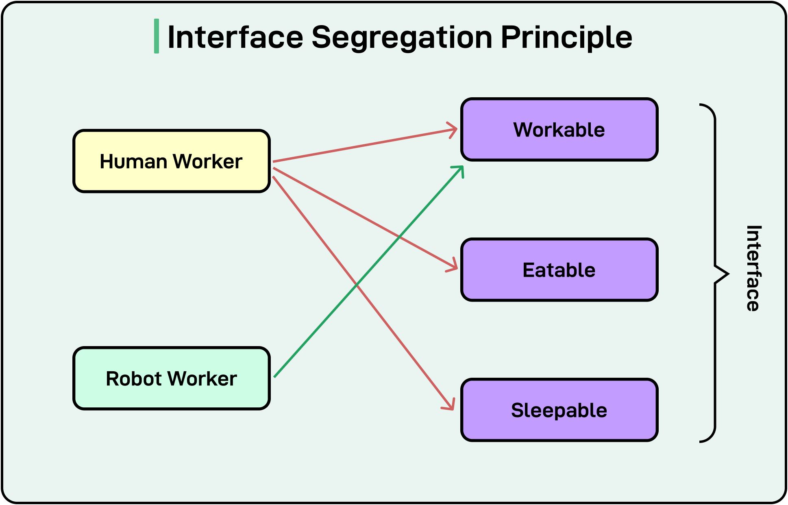

See the example below:

```jshelllanguage
// Separate interface for working
interface Workable {
    void work();
}

// Separate interface for eating
interface Eatable {
    void eat();
}

// Separate interface for sleeping
interface Sleepable {
    void sleep();
}

// Human worker implements all relevant interfaces
class HumanWorker implements Workable, Eatable, Sleepable {
    @Override
    public void work() {
        System.out.println("Human is working.");
    }

    @Override
    public void eat() {
        System.out.println("Human is eating.");
    }

    @Override
    public void sleep() {
        System.out.println("Human is sleeping.");
    }
}

// Robot worker only implements the Workable interface
class RobotWorker implements Workable {
    @Override
    public void work() {
        System.out.println("Robot is working.");
    }
}

// Main class to test ISP compliance
public class Main {
    public static void main(String[] args) {
        Workable human = new HumanWorker();
        human.work();  // Works fine

        Workable robot = new RobotWorker();
        robot.work();  // Works fine, and no unnecessary methods are forced
    }
}
```

In this approach, each interface is small and specific. A class can implement only those behaviors that it needs. No class is forced to implement unnecessary methods. For example, RobotWorker only implements Workable.

### 5 - Dependency Inversion Principle (D)

The Dependency Inversion Principle (DIP) states that high-level modules should not depend on low-level modules. Both should depend on abstractions.

Here, high-level modules contain business logic and the low-level modules handle concerns like database connections, file systems, or third-party services. The goal is that both high-level and low-level modules should depend on an interface. This helps reduce tight coupling and improves flexibility.

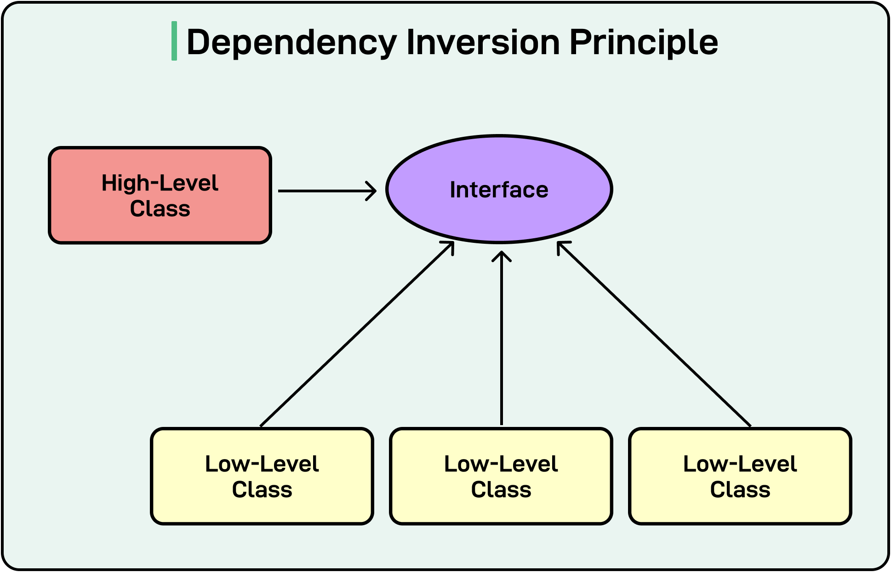

For example, here’s a class that violates the DIP.

```jshelllanguage
// Low-level module: MySQLDatabase
class MySQLDatabase {
    public void saveData(String data) {
        System.out.println("Saving data to MySQL: " + data);
    }
}

// High-level module: UserService
class UserService {
    private MySQLDatabase database; // Direct dependency on a concrete class

    public UserService() {
        this.database = new MySQLDatabase(); // Hardcoded dependency
    }

    public void registerUser(String username) {
        database.saveData(username);
        System.out.println("User registered successfully.");
    }
}

// Main class to test the functionality
public class Main {
    public static void main(String[] args) {
        UserService userService = new UserService();
        userService.registerUser("JohnDoe");
    }
}
```

UserService is tightly coupled to MySQLDatabase. If we want to switch to another database (for example, PostgreSQL), we must modify UserService. Unit testing UserService is difficult because it always depends on a real MySQL database.

To follow DIP, we can introduce an abstraction (interface Database) that both MySQLDatabase and other databases can implement.

```jshelllanguage
// Step 1: Create an abstraction (interface)
interface Database {
    void saveData(String data);
}

// Step 2: Implement the abstraction in different database classes
class MySQLDatabase implements Database {
    @Override
    public void saveData(String data) {
        System.out.println("Saving data to MySQL: " + data);
    }
}

class PostgreSQLDatabase implements Database {
    @Override
    public void saveData(String data) {
        System.out.println("Saving data to PostgreSQL: " + data);
    }
}

// Step 3: Modify UserService to depend on abstraction
class UserService {
    private Database database; // Depend on abstraction, not a concrete class

    public UserService(Database database) { // Inject dependency through constructor
        this.database = database;
    }

    public void registerUser(String username) {
        database.saveData(username);
        System.out.println("User registered successfully.");
    }
}

// Step 4: Use dependency injection in the main class
public class Main {
    public static void main(String[] args) {
        Database mySQLDatabase = new MySQLDatabase();
        UserService userService1 = new UserService(mySQLDatabase);
        userService1.registerUser("JohnDoe");

        Database postgreSQLDatabase = new PostgreSQLDatabase();
        UserService userService2 = new UserService(postgreSQLDatabase);
        userService2.registerUser("JaneDoe");
    }
}
```

In this example, high-level module (UserService) depends on an abstraction (Database), not a concrete class. Also, low-level modules (MySQLDatabase, PostgreSQLDatabase) implement the Database interface. UserService can work with any database without modification.

## Summary

In this article, we have looked at object-oriented programming principles and the SOLID principles in detail with appropriate examples.

Let’s summarize the key learning points in brief:

* There are four main fundamentals to consider in OOP: encapsulation, abstraction, inheritance, polymorphism.
* Encapsulation bundles data and behavior within a class, restricting direct access to internal details.
* Abstraction hides complex implementation details and provides a simplified interface for interacting with objects.
* Inheritance enables code reuse by allowing a child class to inherit attributes and behaviors from a parent class, forming a hierarchical structure.
* Polymorphism allows objects to take multiple forms, enabling method overloading (compile-time polymorphism) and method overriding (runtime polymorphism).
* However, OOP principles alone do not guarantee maintainable code. SOLID principles provide guidelines for designing scalable and flexible object-oriented systems.
* Single Responsibility Principle suggests that a class should have only one reason to change, ensuring each class has a single, well-defined responsibility.
* Open/Closed Principle says that a class should be open for extension but closed for modification, meaning new functionality should be added without altering existing code.
* Liskov Substitution Principle states that a subclass must be replaceable for its parent class without breaking the system.
* Interface Segregation Principle suggests that large interfaces should be split into smaller, specific ones, ensuring that classes do not implement unnecessary methods.
* Dependency Inversion Principle says that high-level modules should not depend on low-level modules. Both should depend on abstractions.
